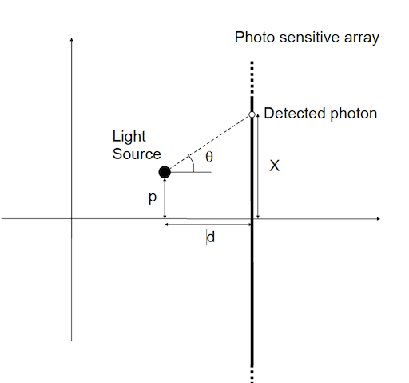

# A collection of problems we are discussing

## Problem 1
In a specified 24-hour period, a student wakes up at time T1 and goes to sleep at some later time T2. The
student always goes to sleep after he wakes up. Students do not stay up after midnight! The outcomes of
the random experiment are the pairs (T1, T2).
1. Find the sample space and sketch it on the x-y plane.
2. Consider the event A: “student is awake at 9 am.” Specify the set A and sketch it on the on the x-y
plane.
3. Consider the even B: “Student is asleep more than he is awake.” Specify the set B and sketch it on
the on the x-y plane.
4. Sketch the region corresponding to the event $A^c \cap B$ and describe the corresponding event in words.


## Problem 2
For $A_1, A_2, \dots, A_n \in \mathcal{F}$, show that

$$
P\left( \bigcup_{i=1}^{n} A_i \right) \leq \sum_{i=1}^{n} P(A_i)
$$

## Probelem 3
Let $A_1, A_2, \dots, A_n$ be events where $n \geq 2$, and prove that

$$
P\left( \bigcup_{i=1}^{n} A_i \right) = \sum_{i=1}^{n} P(A_i) - \sum_{1 \leq i < j \leq n} P(A_i \cap A_j) + \sum_{1 \leq i < j < k \leq n} P(A_i \cap A_j \cap A_k) - \cdots + (-1)^{n+1} P(A_1 \cap A_2 \cap \cdots \cap A_n)
$$

## Problem 4
Given the following context tree
```
        Root
        /  \
      0     1
    B(3/4)  /  \
           0 (01)  1 (11)
        B(1/3)   B(1/4)
```


- Root → 0: Bernoulli(3/4) means that after observing a 0, the next bit has a 3/4 chance of being 1.
- Suffix 01: Bernoulli(1/3) means that after observing the sequence 01, the next bit has a 1/3 chance of being 1.
- Suffix 11: Bernoulli(1/4) means that after observing 11, the next bit has a 1/4 chance of being 1.

The extended tree is shown below.
```
            Root
        /         \
      0            1
    /   \         /  \
  0 (00) 1 (10) 0 (01)  1 (11)
  B(3/4) B(3/4) B(1/3)  B(1/4)
```

Write out the Transition Matrix and solve the Statrionary probabilities P(0) and P(1)


## Problem 5a
If $X$ is geometric, show that $P(X = n + k \mid X > n) = P(X = k)$ for $k, n \geq 1$. 

Why do you think that this is called the "lack of memory" property? Does any other distribution on the positive integers have this property?

## Problem 5b
Show that the exponential variable also has the "lack of memory" property. This is similar to problem 5

## Problem 5c
Show that if a random variable has the "lack of memory" property, then it must be a geometric random variable or an exponential random variable

## Problem 6


We consider the following physical experiment. A (low-energy) light source is at some unknown position $p$. By capturing the photons emitted by the light source, we want to find its position $p$. The experimental setup is shown in the figure above. We only consider the position estimation in one dimension. The light source emits photons in a random direction, with any direction equally probable. A photon emitted with an angle $ \theta \in (-\frac{\pi}{2}, \frac{\pi}{2})$ impinges on a photosensitive plate (e.g., a one-dimensional CCD array). Whenever a photon arrives, its arrival position $X$ is registered. The photons that do not hit the plate are disregarded. We assume that:

- All emitted photons with $\theta \in (-\frac{\pi}{2}, \frac{\pi}{2})$ are detected.
- The plate is infinitely long (both upwards and downwards).
- The position of arrival is detected with no uncertainty.

We try to determine $p$ by taking the average position over $n$ photons.

Solve the following problems:

1. Show that $X$ is distributed as a Cauchy variable with PDF:
   $$f_X(x) = \frac{1}{\pi} \frac{d}{(x - p)^2 + d^2}$$
2. Argue that:
   $$\lim_{a \to \infty} \int_{-a}^{a} x f_X(x) \, dx = p
   \quad \text{and} \quad
   \lim_{a \to \infty} \int_{-a}^{a} |x| f_X(x) \, dx = \infty$$
   
   Thus, we can calculate a meaningful expectation, although the expectation is not mathematically well-defined. What does that mean in practice? To investigate this, perform the following computer experiment using MATLAB or Python. In the following, set $\( d = 1 \)$ and $\( p = 0 \)$.

3. Use a random number generator to generate $n$ outcomes of the random variable $X$, and calculate their average. Repeat this experiment 100 times, each time with $n$ different samples, and plot the 100 different averages. Do the experiment for different values of $n$ (between 100 and 100,000). When $n$ is large, we would expect the average to approximately equal $p$. Is this true?

4. For comparison, repeat question 3, but let $X$ be Gaussian distributed (we only use this for comparison; the Gaussian distribution has nothing to do with the physical experiment). When $n$ is large, is the average approximately equal to $p$?

Finally some speculative questions

5. Of course, in a real experiment the plate would not be infinitely long, and the resolution not infinitely
accurate. Does our results for the ideal case still tell us something about the real world experiment?

6. Instead of using the average, could you find another way of estimating the position, using the same
data?

## Problem 7
- Let $P \sim U(0,1)$ be a random variable.
- Let $X_1, X2, \dots, X_n$ be random variables such that, conditioned on $P = p$, they are independent and identically distributed (iid) Bernoulli random variables with parameter p.
  - That is, conditioned on $P = p$, we have:
    $$\[
    X_i | P = p \sim \text{Bernoulli}(p) \quad \text{for } i = 1, 2, \dots, n.
    \]$$
1. What is the distribution of $\( X_1, X_2, \dots, X_n \)$
2. What is $\( \mathbb{E}[P | X_1, X_2, \dots, X_n] \)$?


